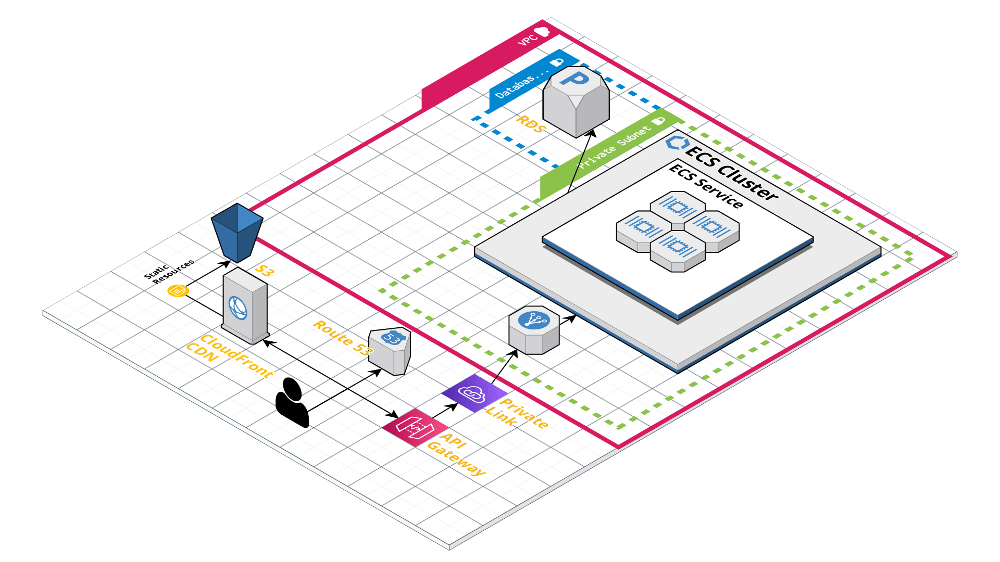

# Terraform IasC for Full Stack Containerized Application

This project is designed to create an infrastructure as code for fullstack, containerized applications on AWS using Terraform. The infrastructure consists of the following AWS services:

- ECS (Elastic Container Service)
- API Gateway w/ VPC Link
- VPC Link to integrate API Gateway with the private subnet resources
- Application Load Balancer to route requests from API Gateway to the ECS Cluster
- Route53 record for Cloudfront/Api Gateway custom domain
- AWS RDS with MySQL
- Cloudfront + S3 for static hosting
- ECS task with a basic .NET weather API for demonstration purposes

## Prerequisites

Before getting started, you will need to have the following installed on your machine:

- AWS CLI
- Terraform CLI

## Getting Started

1. Clone the repository to your local machine.
2. Navigate to the terraform directory.
3. Run `terraform init` to initialize Terraform.
4. Run `terraform plan` to see what changes will be made to your infrastructure.
5. Run `terraform apply` to create the infrastructure on AWS.
6. (Optional) Run `terraform destroy` to destroy the infrastructure.

## License

> MIT License
>
> Copyright (c) 2022 Eams.dev
>
> Permission is hereby granted, free of charge, to any person obtaining a copy
> of this software and associated documentation files (the "Software"), to deal
> in the Software without restriction, including without limitation the rights
> to use, copy, modify, merge, publish, distribute, sublicense, and/or sell
> copies of the Software, and to permit persons to whom the Software is
> furnished to do so, subject to the following conditions:
>
> The above copyright notice and this permission notice shall be included in all
> copies or substantial portions of the Software.
>
> THE SOFTWARE IS PROVIDED "AS IS", WITHOUT WARRANTY OF ANY KIND, EXPRESS OR
> IMPLIED, INCLUDING BUT NOT LIMITED TO THE WARRANTIES OF MERCHANTABILITY,
> FITNESS FOR A PARTICULAR PURPOSE AND NONINFRINGEMENT. IN NO EVENT SHALL THE
> AUTHORS OR COPYRIGHT HOLDERS BE LIABLE FOR ANY CLAIM, DAMAGES OR OTHER
> LIABILITY, WHETHER IN AN ACTION OF CONTRACT, TORT OR OTHERWISE, ARISING FROM,
> OUT OF OR IN CONNECTION WITH THE SOFTWARE OR THE USE OR OTHER DEALINGS IN THE
> SOFTWARE.